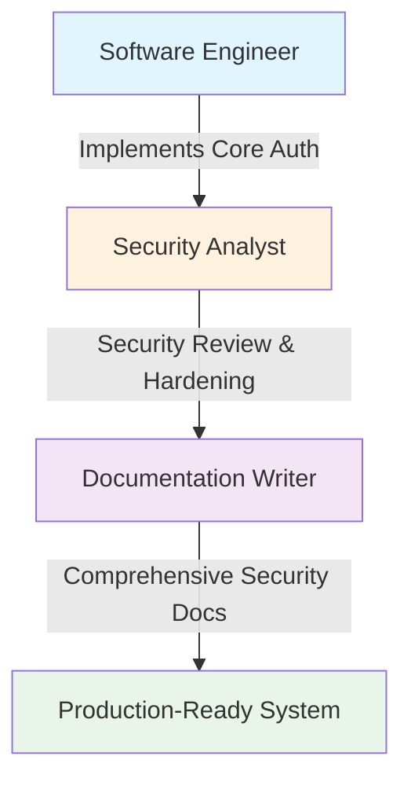

# 🔐 Secure Authentication Pipeline Example

A comprehensive example demonstrating **sequential subagent orchestration** where specialized agents build upon each other's work in a structured workflow to implement a secure JWT authentication system.

## Overview

This example showcases how to orchestrate multiple AI agents in sequence, where each agent:
- Builds directly on the previous agent's output
- Contributes specialized expertise to the overall solution
- Participates in iterative refinement cycles
- Collaborates to produce a production-ready, secure feature

## Sequential Agent Workflow



### 🛠️ Phase 1: Software Engineer
**Expertise**: Full-stack development, API design, authentication systems

**Responsibilities**:
- Implement JWT token generation and validation
- Create authentication middleware and route protection
- Build login/logout API endpoints
- Develop client-side authentication integration
- Implement token refresh mechanisms
- Basic input validation and error handling

### 🔒 Phase 2: Security Analyst  
**Expertise**: Application security, vulnerability assessment, OWASP compliance

**Responsibilities**:
- Comprehensive security review of authentication implementation
- OWASP Top 10 vulnerability assessment and mitigation
- Rate limiting and brute force protection
- Security headers and transport layer security
- Input sanitization and injection attack prevention
- Secure token storage and session management hardening
- Security configuration and environment hardening

### 📖 Phase 3: Documentation Writer
**Expertise**: Technical writing, security documentation, developer education

**Responsibilities**:
- Security architecture documentation
- Developer implementation guides
- Threat model and security best practices
- API documentation with security considerations
- Troubleshooting guides and common security issues
- Deployment and configuration guidelines

## Key Features Demonstrated

### Sequential Orchestration
- **Clear Dependencies**: Each agent depends on the previous agent's work
- **Context Passing**: Agents receive and build upon prior outputs
- **Specialized Expertise**: Each agent contributes unique domain knowledge
- **Iterative Refinement**: Multiple feedback cycles improve the final result

### Multi-Agent Collaboration Patterns
- **Handoff Protocols**: Structured transitions between agents
- **Cross-Agent Communication**: Agents reference and enhance each other's work
- **Quality Gates**: Each phase includes validation and feedback loops
- **Persistent Context**: Full conversation history enables sophisticated collaboration

## Technical Implementation

The example implements a complete JWT authentication system with:

### Core Authentication Features
- JWT token generation with secure algorithms (RS256/HS256)
- Authentication middleware for route protection
- Login/logout endpoints with proper error handling
- Token refresh mechanism with rotation
- Client-side authentication state management

### Security Hardening
- Rate limiting on authentication endpoints
- OWASP compliance (Top 10 vulnerability mitigation)
- Security headers (CSP, HSTS, X-Frame-Options, etc.)
- Input validation and sanitization
- Secure token storage patterns (httpOnly cookies)
- CORS configuration for API security
- Brute force attack protection

### Documentation & Guidance
- Security architecture overview
- Implementation guides for developers
- Threat modeling and risk assessment
- API reference with security considerations
- Troubleshooting and common issues
- Deployment security checklist

## Usage

### Prerequisites
- Built `cs-cc` CLI (available at `../../cs-cc`)
- GitHub personal access token with repo permissions
- Anthropic API key
- Access to target GitHub repository

### Environment Setup
```bash
export GITHUB_TOKEN="your_github_personal_access_token"
export ANTHROPIC_API_KEY="your_anthropic_api_key"
```

### Running the Example
```bash
cd secure-auth-pipeline
./run-example.sh
```

### What Happens
1. **Sandbox Creation**: Creates a persistent development environment
2. **Sequential Agent Execution**: Runs agents in order with full context sharing
3. **Iterative Refinement**: Multiple rounds of feedback and improvements
4. **Git Workflow**: Creates feature branch, commits changes, opens PR
5. **Quality Validation**: Final security and functionality verification

### Expected Output
- Complete JWT authentication system implementation
- Security hardening with OWASP compliance
- Comprehensive security documentation
- GitHub Pull Request with detailed description
- Production-ready code with security best practices

## File Structure

```
secure-auth-pipeline/
├── README.md                    # This comprehensive guide
├── orchestration-prompt.txt     # Main orchestration instructions
├── mcp-tools.json              # Agent definitions and prompts
├── tool-whitelist.json         # Available tools configuration
└── run-example.sh              # Execution script
```

## Understanding Sequential Orchestration

### Why Sequential vs Parallel?
Sequential orchestration is ideal when:
- **Dependencies exist**: Security review can't happen before implementation
- **Context accumulation**: Each agent builds on growing context
- **Quality progression**: Later agents refine and improve earlier work
- **Expertise flow**: Different skill sets applied in logical order

### Orchestration Patterns Used
1. **Explicit Agent Calling**: Direct agent invocation with specific tasks
2. **Context Inheritance**: Each agent receives full conversation history
3. **Feedback Loops**: Multiple rounds of refinement and improvement
4. **Quality Gates**: Validation checkpoints between phases
5. **Persistent Sessions**: Long-running collaboration maintaining context

### Best Practices Demonstrated
- **Clear Task Definition**: Specific, actionable instructions for each agent
- **Context Preservation**: Full conversation history maintained across agents
- **Iterative Improvement**: Multiple refinement cycles for quality
- **Specialized Expertise**: Each agent focuses on their domain strengths
- **Integration Validation**: Ensuring all components work together

## Troubleshooting

### Common Issues
- **Permission Errors**: Ensure `run-example.sh` is executable (`chmod +x`)
- **Missing Environment Variables**: Verify `GITHUB_TOKEN` and `ANTHROPIC_API_KEY`
- **CLI Path Issues**: Check that `cs-cc` is built and accessible
- **GitHub Access**: Verify token has repository access permissions

### Debug Mode
The example runs with `--debug yes` to show real-time agent execution and output streaming.

### Sandbox Persistence
Sandbox is created with `-d no` to allow inspection of the final implementation.

## Learning Objectives

After running this example, you'll understand:
- How to design sequential multi-agent workflows
- Techniques for effective agent orchestration
- Methods for maintaining context across agent interactions
- Patterns for iterative refinement and quality improvement
- Integration of specialized AI agents for complex tasks

## Extension Ideas

Consider modifying this example to explore:
- **Different Agent Sequences**: Try different orderings or additional agents
- **Parallel + Sequential Hybrid**: Combine parallel and sequential patterns
- **Domain-Specific Workflows**: Apply to other domains (DevOps, testing, etc.)
- **Quality Metrics**: Add quantitative validation between phases
- **Custom Agents**: Create specialized agents for your specific use cases